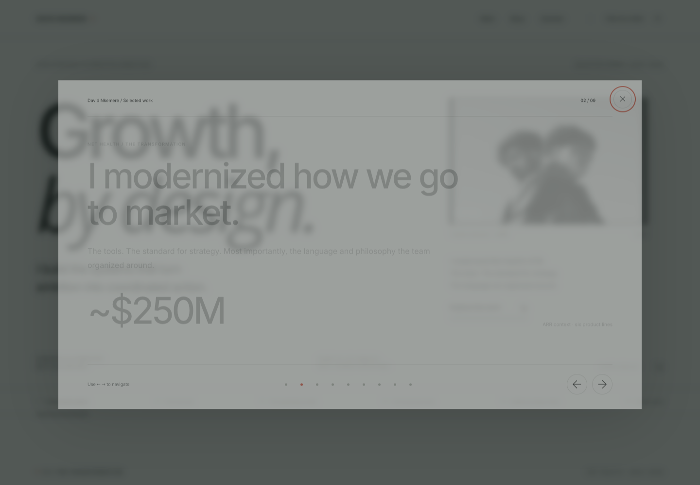

# Validation — October 5, 2026

`npm run check` passes: production build and TypeScript validation.

The production server was inspected with a separate headless Chromium test browser. No application page errors were observed. The following checks passed:

- Server-rendered homepage and page title.
- Layout width at 1440, 760, 390 and 320 pixels; no document-wide horizontal overflow.
- All local images and SVG exhibits load.
- Deck opens, responds to arrow/Home/End keys, closes with Escape and restores trigger focus.
- Operating model tabs respond to clicks and keyboard navigation.
- Evidence overlays open and close.
- Article preview points to the original XXL article.
- KAIRO video overlay points to the correct YouTube embed and provides a direct video link.
- Pilot readout displays the LinkedIn breakdown.
- Mobile navigation opens and closes on selection.
- California Deep Clean is the section immediately before KAIRO.

Video embed source and fallback links were checked; external YouTube playback and third-party destination content were not independently verified in this environment. Contact uses a mailto link; no message was sent.

## Preview captures

