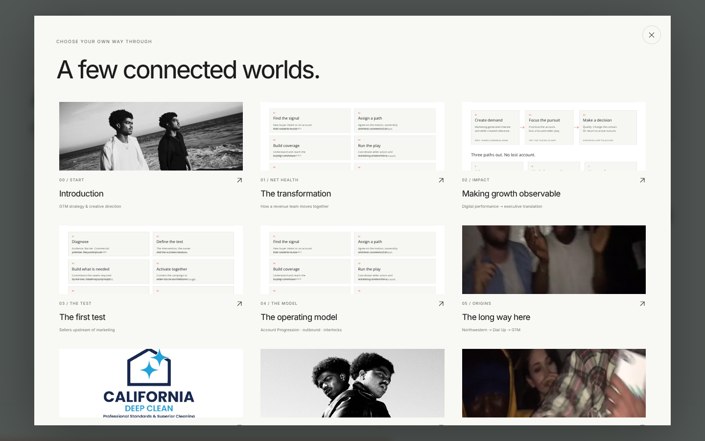
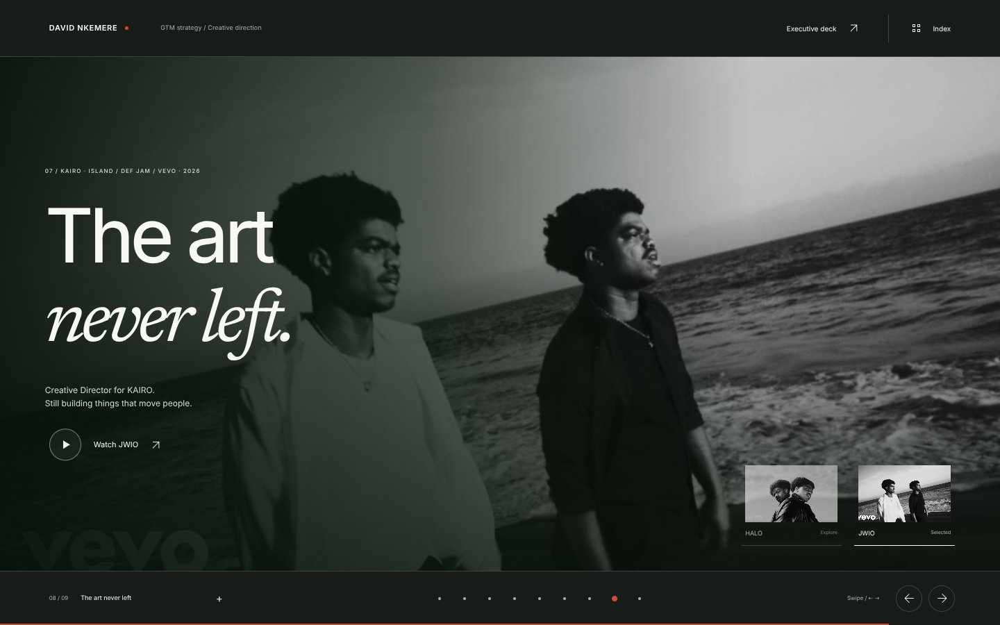

# Interactive revision — October 5, 2026

`npm run check` passes: production build and TypeScript validation.

The production application passed 19 interaction checks and 45 chapter-layout checks in Chromium. No application page errors were observed.

## Interaction verification

- Nine full-screen horizontal chapters; the document stays within the viewport.
- Next/previous controls, keyboard navigation, native touch swipe, wheel navigation and direct chapter hashes.
- Visual index opens and jumps to the selected chapter.
- Offscreen chapters are inert; dialogs close with Escape and restore focus, including nested source previews.
- Account Progression stages change their explanation. Model tabs work with clicks and arrow keys without advancing chapters.
- Pilot period switch displays the correct 2024 and 2025 observations.
- Executive exhibits and photo archive open; the lightbox responds to arrow keys.
- Dial Up archive film starts and pauses on request; playback was verified.
- KAIRO selector changes the film and uses the corresponding YouTube embed.
- Executive deck supports arrow/Home/End navigation.
- California Deep Clean immediately precedes KAIRO.
- Reduced-motion preferences disable smooth transitions.
- All local images load.

## Layout verification

All nine chapters were checked at 1280×720, 1024×768, 760×844, 390×844 and 320×568. No document-wide overflow or clipped horizontal chapter content was observed. Longer chapters scroll internally on small screens, while chapter controls remain visible. The mobile visual index fits its dialog.

YouTube embed sources and direct fallback links were checked; third-party playback was not independently verified. Contact uses a mailto link; no message was sent. Lovable transfer and publication remain unverified because its editing and publishing tools are unavailable in the current session.

## Motion and navigation

[Watch the 22-second walkthrough](previews/walkthrough.mp4)

The recording shows the production application: chapter transitions, an expanded exhibit, the pilot comparison, Account Progression, the visual index, archive playback, California Deep Clean and the KAIRO selector.

## Preview captures

