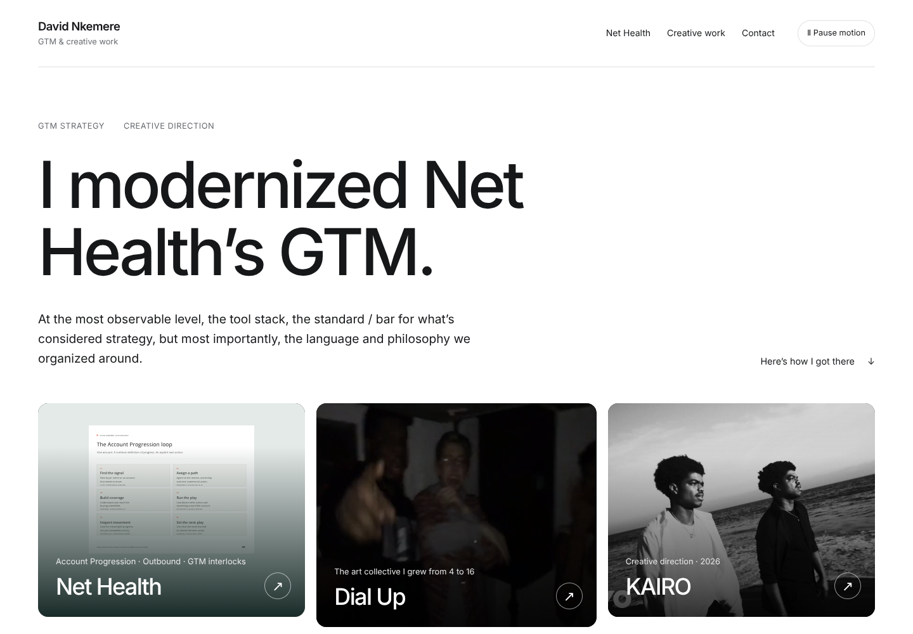
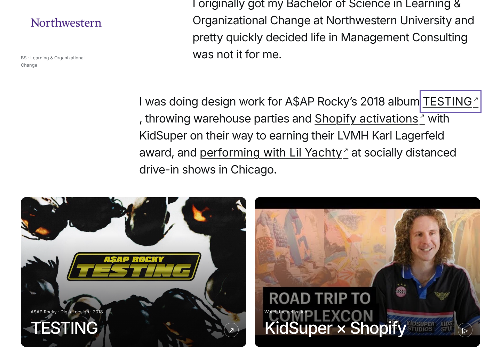
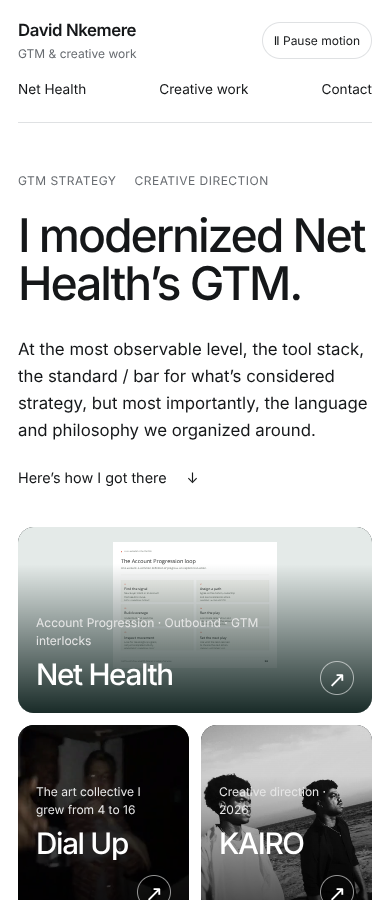
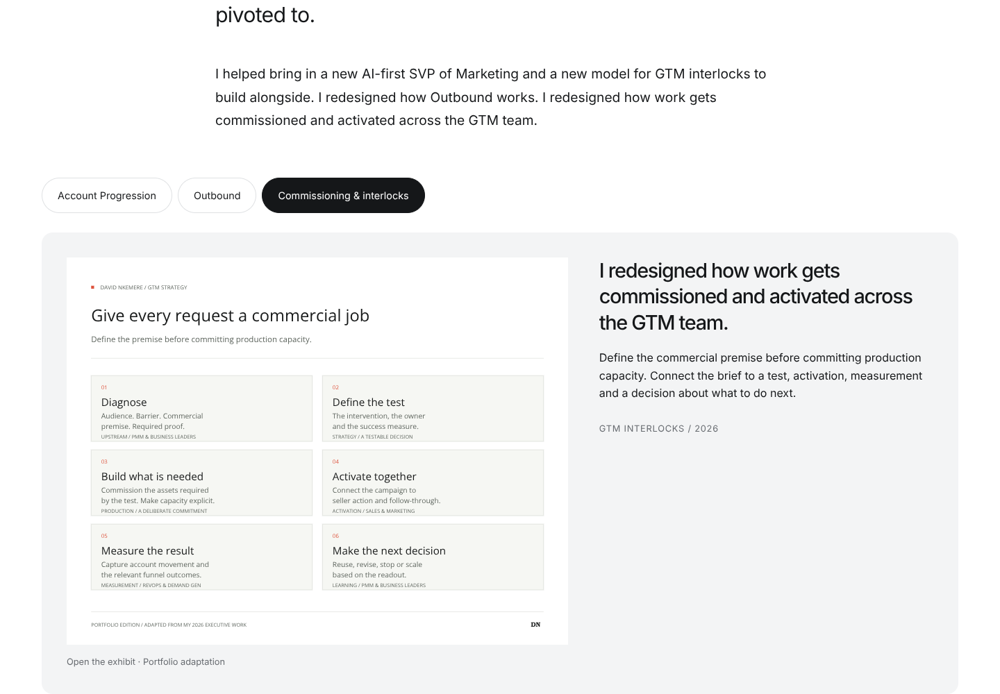
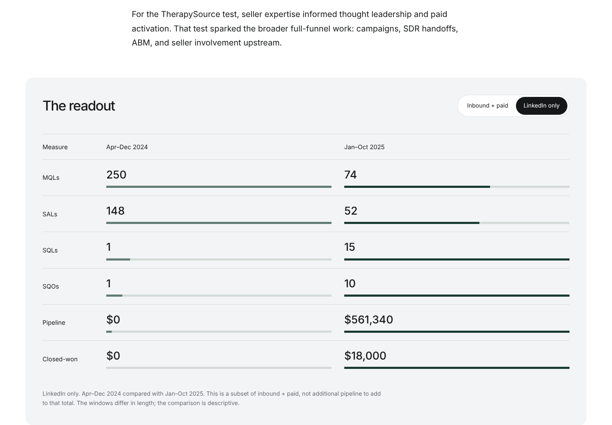

# Narrative revision — October 5, 2026

Production build and TypeScript pass. Additional TypeScript checks match the Lovable project's strict array-index, optional-property, return-path, and index-signature settings.

The built application passed 77 checks in Chromium, including 24 route/viewport layout checks across the homepage and all five story pages at 320, 390, 768, and 1440 pixels. No page errors or horizontal document overflow were observed. All image assets loaded.

Verified original opening and Nigerian-parents story; natural document reading; actual story URLs and route titles; native browser back; source popups and original links; Escape dismissal and focus restoration; Shopify video timestamp; both KAIRO embed IDs; visible video playback; global pause and popup pause; reduced-motion initial state; account stages, model tabs, and exhibit expansion; exact inbound and LinkedIn-subset totals; mobile popup fit; 200% text enlargement; California Deep Clean directly before KAIRO.

YouTube embed URLs and fallback links are verified. Third-party video playback is not independently verified in the restricted execution environment.

## Previews

## Lovable

Direct GitHub sync is used, preserving Lovable's infrastructure. See LOVABLE-TRANSFER.md for the current synced revision and publication result. A pending publish response is not proof that the public URL serves the new version.
